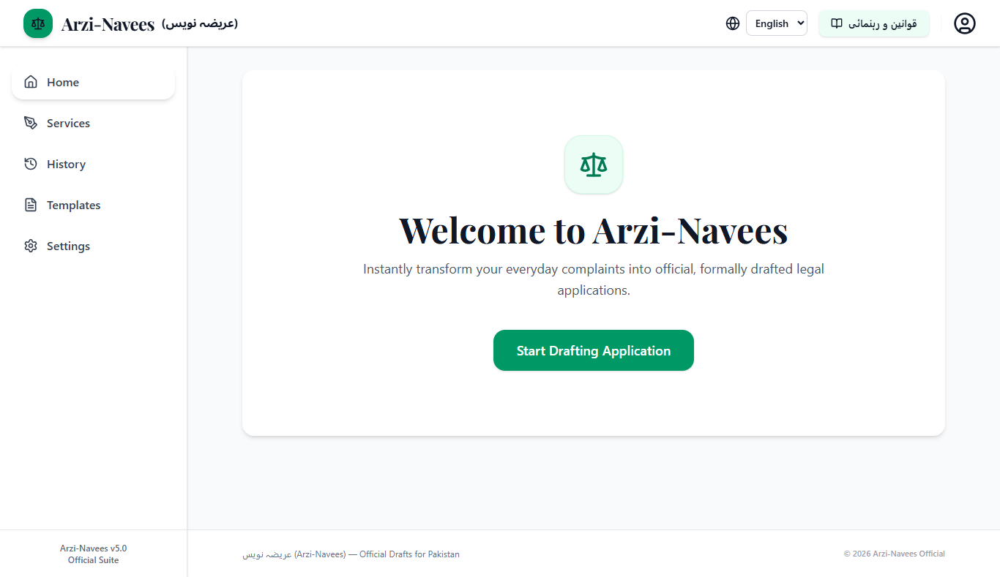
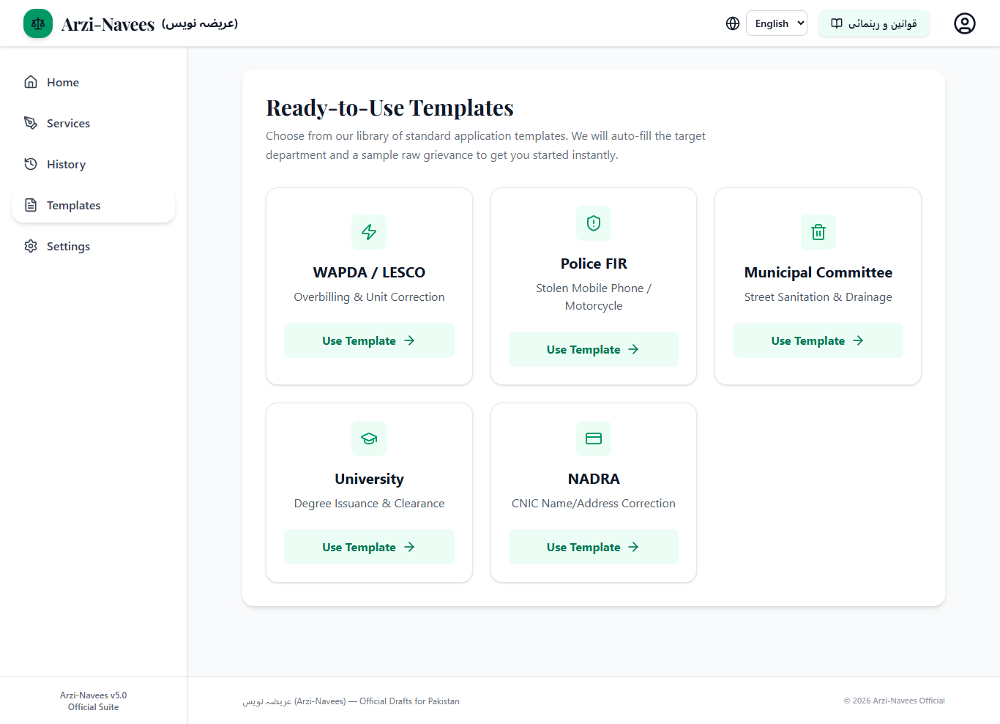
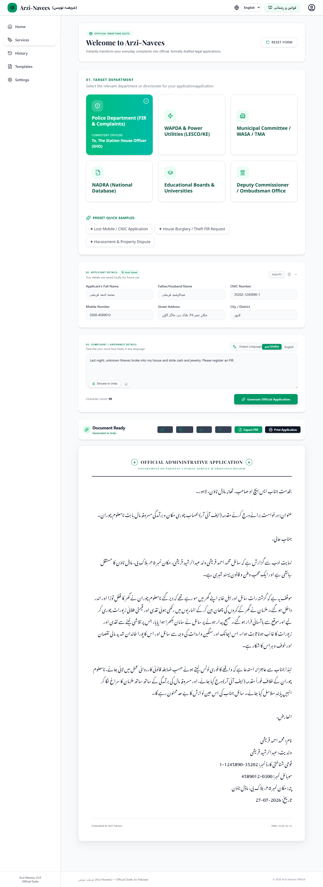
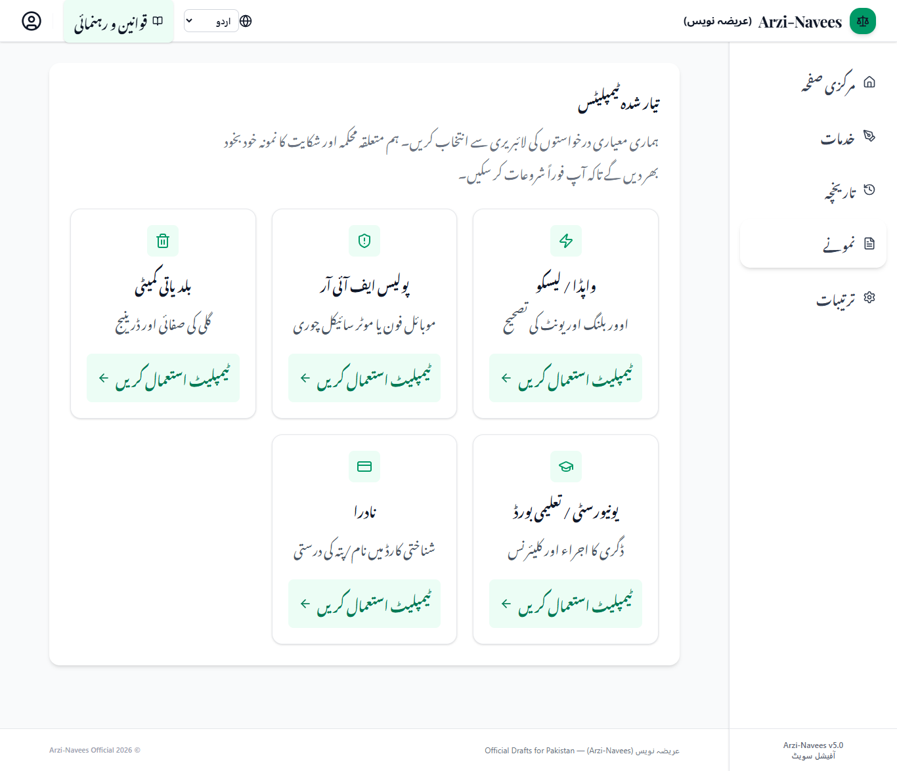

# 📝 Arzi-Navees (عرضی نویس) – Official Drafts for Pakistan


<p align="center">


</p>

> **AI-Powered Government Application Drafting Assistant for Pakistan**


Arzi-Navees is a full-stack AI-powered web application that transforms informal complaints into professionally written Government applications using Google Gemini AI. Citizens can write in **English**, **Urdu**, or **Roman Urdu**, and receive a formal administrative application that is ready for printing, PDF export, or submission to the relevant Government department.


---


# 🌐 Live Demo


### 🚀 Live Application


https://arzinaves.ai.studio


### 💻 GitHub Repository


https://github.com/naveed02207/arzi-navees


---


# 📑 Table of Contents


- Problem Statement

- Solution

- Workflow

- Features

- AI Feature

- Technology Stack

- System Architecture

- Installation

- Usage

- Security

- Performance

- Screenshots

- Future Improvements

- Assignment Mapping

- License


---


# ❗ Problem Statement

Writing formal Government applications in Pakistan is often difficult for ordinary citizens.

Many people:

- Do not know formal administrative language.

- Are unfamiliar with legal Urdu.

- Write only in Roman Urdu.

- Depend on roadside petition writers ("Arzi-Navees").

- Spend unnecessary time and money preparing simple Government applications.

Whether applying to Police, NADRA, WAPDA, Universities, Municipal Committees, or other Government departments, many citizens struggle to produce professionally written applications.

---


# 💡 Solution

Arzi-Navees removes this barrier by using Artificial Intelligence to instantly convert ordinary complaints into professionally formatted Government applications.

Instead of paying traditional petition writers, users simply describe their issue in everyday language.

Google Gemini AI analyses the complaint and generates a polished Government application that is ready for:

- Printing

- PDF Export

- Copying

- Editing

- Official Submission


---


# 🔄 Workflow


```

        Citizen
           ↓
Select Government Department
           ↓
Fill Applicant Details
           ↓
Write Complaint
(English / Urdu / Roman Urdu)
           ↓
  Google Gemini AI
           ↓
Professional Government Draft
           ↓
    Review & Edit
           ↓
    Export PDF / Print

```


---

# ✨ Features


## 🤖 AI Features

- AI-powered Government application drafting

- Google Gemini AI integration

- Intelligent complaint understanding

- Professional administrative writing

- Formal Government formatting

---

## 🌐 Language Support

- English Interface

- Urdu Interface

- Roman Urdu Support

- RTL Layout Support

- Nastaleeq Urdu Typography

---


## 🏛 Government Departments

Supports application drafting for departments including:


- Police (FIR & Complaints)

- NADRA

- WAPDA / Electricity Utilities

- Municipal Committee / WASA

- Educational Boards & Universities

- Deputy Commissioner / Ombudsman


---


## 📄 Draft Management

- Generate Official Application

- Edit Draft

- Copy Draft

- Save Draft

- Local Draft History

- Auto-fill Applicant Information

---


## 📤 Export Features

- Professional Print Layout

- Export PDF

- TXT Export

- Clean A4 Formatting

- Government-style Document Design

---


## ⚙ Settings

- Output Language

- Print Font Size

- Print Margin Settings

- Applicant Auto Save

---


## 📱 User Experience

- Responsive Design

- Desktop Support

- Tablet Support

- Mobile Support

- Modern Government UI

- Accessibility Friendly

---


# 🤖 AI Feature


The core intelligence of Arzi-Navees is powered by **Google Gemini AI**.


Instead of relying on fixed templates, the application uses prompt engineering to understand the user's complaint and transform it into a professionally structured Government application.

The AI is instructed to:

- Understand informal complaints.

- Preserve factual information.

- Produce formal Government language.

- Generate structured administrative applications.

- Maintain a respectful and professional tone.

- Avoid unnecessary conversational responses.

The backend securely communicates with Google Gemini using a protected server-side API, ensuring that API credentials are never exposed to the client.


---


# 🛠 Technology Stack


| Category | Technology |

|-----------|------------|

| Frontend | React 19 |

| Language | TypeScript |

| Styling | Tailwind CSS v4 |

| Backend | Express.js |

| Build Tool | Vite |

| AI Model | Google Gemini |

| Icons | Lucide React |

| State Management | React Hooks + Context API |

| Storage | LocalStorage |

| Deployment | Google AI Studio Hosting |


---

---


# 🏗️ System Architecture


The application follows a secure client-server architecture where all AI interactions are handled on the backend to prevent API key exposure.

```text

                    ┌──────────────────────┐

                    │      End User        │

                    └──────────┬───────────┘

                               │

                               ▼

                 React + TypeScript Frontend

                               │

                               ▼

                     Express Backend API

                               │

                               ▼

                     Google Gemini AI API

                               │

                               ▼

              Official Government Draft Generated

                               │

                               ▼

         Review → Edit → Copy → Export → Print

```


---


# 📁 Project Structure


```

arzi-navees/

│

├── public/

├── src/

│   ├── components/

│   ├── contexts/

│   ├── data/

│   ├── App.tsx

│   ├── main.tsx

│   ├── translations.ts

│   ├── types.ts

│   └── index.css

│

├── server.ts

├── package.json

├── vite.config.ts

├── README.md

└── .env.example

```


---


# ⚙️ Installation


## 1. Clone Repository


```bash

https://github.com/naveed02207/arzi-navees.gits

```


## 2. Enter Project


```bash

cd arzi-navees

```


## 3. Install Dependencies


```bash

npm install

```


## 4. Create Environment File


Create a `.env` file in the project root.


```env

GEMINI_API_KEY=YOUR_API_KEY

```


---


## 5. Run Development Server


```bash

npm run dev

```


Open:


```

http://localhost:5173

```


---


## Production Build


```bash

npm run build

```


---


## Preview Production Build


```bash

npm run preview

```


---


# 🔐 Environment Variables

| Variable | Description |

|-----------|-------------|

| `GEMINI_API_KEY` | Google Gemini API Key used securely by the backend Express server. |


> **Security Notice:**  

> API keys are never exposed to the browser. All AI requests are processed securely through the backend.


---

# 🚀 How to Use


Using Arzi-Navees is simple:


### Step 1


Choose the relevant Government Department.


Examples:


- Police

- NADRA

- WAPDA

- Municipal Committee

- University

- Deputy Commissioner


---


### Step 2


Fill in applicant details.


- Name

- Father's/Husband's Name

- CNIC

- Address

- Mobile Number

- City


---


### Step 3


Describe your complaint.


You may write in:


- English

- Urdu

- Roman Urdu


---


### Step 4


Click


**Generate Official Application**


---


### Step 5


Google Gemini AI generates a professionally formatted Government application.


---


### Step 6


Review the generated application.


Available options:


- Edit

- Copy

- Save

- Export PDF

- Print


---


# 🎨 Design Decisions


## React


Chosen for component-based architecture and efficient UI rendering.


## TypeScript


Provides strong typing, better maintainability, and fewer runtime errors.


## Vite


Fast development server and optimized production builds.


## Express


Acts as a secure backend proxy between the frontend and Google Gemini API.


## Tailwind CSS


Rapid UI development with responsive design and RTL support.


## Google Gemini


Used to intelligently transform informal complaints into professionally written Government applications.


## Local Storage


Stores applicant details and draft history locally for a faster user experience without requiring user accounts.


---


# 🔒 Security


The project follows several security best practices:


- Google Gemini API key remains on the backend.

- No API keys are exposed to the client.

- Environment variables are ignored through `.gitignore`.

- User input is processed server-side.

- AI communication happens only through secure backend endpoints.

- Sensitive configuration files are excluded from GitHub.


---


# ⚡ Performance Optimisations


Several optimisations were implemented:


- React.memo

- useCallback

- Lazy Loading

- Code Splitting

- Manual Chunking

- TypeScript Optimisation

- Optimised Vite Production Build

- Responsive Tailwind Components

- Reduced unnecessary re-renders


These improvements ensure smooth performance across desktop and mobile devices.


---

---


# 📸 Screenshots


## 🏠 Home Page


The landing page introduces Arzi-Navees and allows users to start drafting official Government applications.





---


## 🏛 Templates Library


Ready-to-use templates help users quickly generate applications for common Government services such as Police, WAPDA, NADRA, Universities, and Municipal Committees.





---


## 🤖 AI-Generated Official Application


Google Gemini AI converts informal complaints written in English, Urdu, or Roman Urdu into professionally formatted Government applications ready for printing and submission.


 


## 🌐 Urdu Interface


Complete Right-to-Left (RTL) interface with Urdu localisation and Nastaleeq typography.





---


# 🚀 Future Improvements


The current version is fully functional, but several enhancements could further improve the platform:


- User authentication and cloud account support

- Cloud synchronisation of saved drafts

- Digital signature integration

- OCR-based document scanning

- Voice-to-text support for more languages

- Integration with official Government portals (where APIs become available)

- AI-powered application quality scoring

- Multi-document generation in a single workflow

- Email and WhatsApp sharing

- Offline Progressive Web App (PWA) support


---


# ✅ Assignment Requirements Mapping


| Assignment Requirement | Implementation in Arzi-Navees |

|------------------------|-------------------------------|

| Original Idea | ✅ AI-powered Government application drafting assistant solving a real-world problem in Pakistan |

| Complete Functional App | ✅ End-to-end workflow from complaint input to printable Government application |

| AI-Powered Feature | ✅ Google Gemini AI generates formal Government applications |

| Public GitHub Repository | ✅ Source code available in a public GitHub repository |

| Live Deployment | ✅ Public deployment available for testing |

| README Documentation | ✅ Comprehensive documentation including setup, architecture, AI feature, screenshots, and usage |


---


# 🧪 Testing


The application was manually tested for:


- ✅ English complaints

- ✅ Urdu complaints

- ✅ Roman Urdu complaints

- ✅ Department selection

- ✅ Applicant information handling

- ✅ AI draft generation

- ✅ Draft editing

- ✅ Copy functionality

- ✅ PDF export

- ✅ Print layout

- ✅ Local draft history

- ✅ Responsive design

- ✅ RTL interface

- ✅ Production build


---


# 🤝 Acknowledgements


This project would not have been possible without the following technologies and communities:


- Google Gemini AI

- React

- TypeScript

- Vite

- Express.js

- Tailwind CSS

- Lucide React

- Node.js

- Open Source Community


Special thanks to the developers and maintainers of these technologies for enabling modern AI-powered web applications.


---


# 📄 License


This project is licensed under the **MIT License**.

Feel free to use, modify, and learn from this project while respecting the terms of the license.


---


# 👨‍💻 Author


**Muhammad Naveed Ul Hassan**


BS Information Technology


University of Education, Vehari Campus


GitHub: https://github.com/naveed02207/arzi-navees


Live Project: https://arzinaves.ai.studio


---


# ⭐ Final Notes


Arzi-Navees demonstrates how Artificial Intelligence can be used to solve a practical, everyday problem faced by Pakistani citizens.


By combining modern web technologies with Google Gemini AI, the application simplifies the process of drafting professional Government applications while reducing language barriers, saving time, and improving accessibility.


The project reflects a complete end-to-end AI solution, incorporating secure backend integration, responsive frontend design, multilingual support, and production-ready deployment.


---


## 🌟 If you found this project useful, please consider giving it a ⭐ on GitHub.
