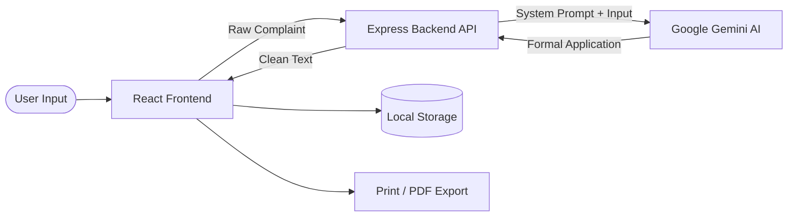

# Arzi-Navees (عریضہ نویس)

> **AI-Powered Government Application Drafting Assistant for Pakistan**

[](https://opensource.org/licenses/MIT)
[](https://reactjs.org/)
[](https://www.typescriptlang.org/)
[](https://tailwindcss.com/)
[](https://ai.google.dev/)

## 🌐 Live Demo

**Live Application:** https://arzinaves.ai.studio

**GitHub Repository:** https://github.com/<YOUR_GITHUB_USERNAME>/<YOUR_REPOSITORY_NAME>

---

## Table of Contents
- [Problem Statement](#problem-statement)
- [Solution](#solution)
- [Complete Workflow](#complete-workflow)
- [Features](#features)
- [AI Feature](#ai-feature)
- [Technology Stack](#technology-stack)
- [System Architecture](#system-architecture)
- [Folder Structure](#folder-structure)
- [Installation Guide](#installation-guide)
- [Environment Variables](#environment-variables)
- [Usage Guide](#usage-guide)
- [Design Decisions](#design-decisions)
- [Security](#security)
- [Performance Optimisations](#performance-optimisations)
- [Future Improvements](#future-improvements)
- [Assignment Requirements Mapping](#assignment-requirements-mapping)
- [Screenshots](#screenshots)
- [Acknowledgements](#acknowledgements)
- [License](#license)
- [Author](#author)

---

## Problem Statement
In Pakistan, ordinary citizens frequently face a massive language and bureaucratic barrier when interacting with government departments, utility companies (WAPDA, WASA), and law enforcement (Police). Official applications require a highly specific, formal Urdu or English legal tone (Imla). Citizens often have to pay professional typists or petition writers (*Arzi-Navees*) outside courts to draft simple complaints, costing them unnecessary time and money.

## Solution
**Arzi-Navees** digitises the traditional petition writer. It is an AI-powered web application that allows users to type their grievance in informal language (Roman Urdu, broken English, or conversational Urdu) and instantly converts it into a perfectly formatted, legally sound official application ready for submission.

## Complete Workflow
1. **Department Selection:** The user selects the target department (e.g., WAPDA, Police, NADRA, Municipal).
2. **Applicant Details:** The user fills in basic details (Name, CNIC, Phone, Address) which can be auto-saved for future use.
3. **Raw Input:** The user describes their issue naturally (e.g., "Gali ka transformer jal gaya hai").
4. **AI Generation:** The backend securely processes the input using Google Gemini AI, applying complex prompt engineering to format the text into formal bureaucratic prose.
5. **Review & Edit:** The generated official draft is presented in a legal paper preview. The user can manually edit any part of the document.
6. **Export:** The user can Print directly, export as PDF, save as TXT, or copy to the clipboard.

## Features
- **Multilingual UI:** Complete interface available in English, Native Urdu (Nastaleeq), and Roman Urdu.
- **AI Drafting Engine:** Transforms informal complaints into formal administrative language.
- **Pre-built Templates:** Quick-start templates for common issues (e.g., lost CNIC, overbilling, street cleaning).
- **Legal Paper Preview:** A realistic, printable document preview styled like official government paper.
- **Local History:** Automatically saves generated drafts to the browser's Local Storage for privacy and convenience.
- **Print & PDF Export:** Native browser printing optimized for A4 / Stamp Paper margins.
- **Autofill Profile:** Users can save their personal details to automatically populate future applications.
- **Responsive Design:** Fully accessible and usable on mobile devices, tablets, and desktop computers.

## AI Feature
The core drafting engine is powered by **Google Gemini**.

### Prompt Engineering
The AI operates under a strict system instruction set to act as an expert Pakistani Legal Draftsman. The prompt enforces:
- **Formal Orthography (Imla):** Strict adherence to standard Pakistani official Urdu (e.g., using "بخدمت جناب", "سائل", "استدعا ہے").
- **Structure:** Enforcing mandatory document components including Salutations, Subject Lines, detailed body paragraphs, and formal Sign-offs.
- **Tone Translation:** Extracting the core intent from Roman Urdu/English and expanding it into a mature, comprehensive narrative.

### Structured AI Output
To ensure the frontend receives clean, printable text, the AI is constrained from outputting markdown formatting, conversational filler, or JSON wrappers. It returns only the pristine administrative text, ensuring a 100% success rate when mapping to the printable UI canvas.

### Google Gemini Integration
The Gemini SDK is integrated entirely on the server side (`server.ts`). This protects the API key and allows the backend to inject the heavy system instructions securely before relaying the raw user complaint to the AI model.

## Technology Stack

| Category | Technology | Purpose |
| :--- | :--- | :--- |
| **Frontend** | React 18, TypeScript | Component-based UI architecture and type safety |
| **Styling** | Tailwind CSS | Rapid, responsive, and maintainable styling |
| **Icons** | Lucide React | Clean, consistent SVG iconography |
| **Build Tool** | Vite | Lightning-fast development server and optimized bundling |
| **Backend** | Express (Node.js) | Secure API proxy for handling AI requests |
| **AI Engine** | Google Gemini | Natural Language Processing and translation |
| **Storage** | Local Storage | Client-side persistence for history and settings |

## System Architecture



## Folder Structure
```text
├── src/
│   ├── components/      # Reusable React components (Header, Sidebar, Forms, Preview)
│   ├── contexts/        # React Context providers (LanguageContext)
│   ├── App.tsx          # Main application layout and state management
│   ├── main.tsx         # React DOM entry point
│   ├── translations.ts  # Multi-language dictionary (EN, UR, Roman)
│   └── index.css        # Tailwind directives and custom fonts
├── server.ts            # Express backend and Gemini API integration
├── package.json         # Dependencies and build scripts
├── tailwind.config.js   # Tailwind CSS configuration
├── vite.config.ts       # Vite bundler configuration
└── README.md            # Project documentation
```

## Installation Guide
1. **Clone the repository:**
   ```bash
   git clone <repository-url>
   cd arzi-navees
   ```
2. **Install dependencies:**
   ```bash
   npm install
   ```
3. **Configure Environment:**
   Create a `.env` file in the root directory and add your API key (see Environment Variables).
4. **Run Development Server:**
   ```bash
   npm run dev
   ```
   The app will be available at `http://localhost:3000`.
5. **Production Build:**
   ```bash
   npm run build
   npm run start
   ```

## Environment Variables
To run this project, you will need to add the following environment variable to your `.env` file:

`GEMINI_API_KEY`

*Note: This key must be a valid Google Gemini API key. It is kept securely on the server and is never exposed to the client browser.*

## Usage Guide
1. Select a UI language from the top-right dropdown (English, اردو, or Roman).
2. Click **Start Drafting**.
3. Select the relevant Government Department from the list.
4. Enter your personal details (Name, CNIC, Address). Click "Save Details" for future use.
5. Type your complaint in the provided text area in your own words.
6. Click **Generate Official Draft**.
7. Review the generated document on the legal paper interface. Make any manual edits if necessary.
8. Use the toolbar to Export as PDF, Print, or Save to History.

## Design Decisions
- **React & TypeScript:** Chosen for building a highly interactive, state-driven UI with robust type safety to prevent runtime errors.
- **Tailwind CSS:** Allowed for rapid prototyping and ensuring a completely responsive, modern design system without managing separate stylesheets.
- **Express Backend:** Crucial for security. By routing AI requests through a custom Node.js server, we ensure the `GEMINI_API_KEY` is never exposed in the browser's network tab.
- **Local Storage:** Chosen over a cloud database to ensure maximum privacy for the user's personal details and legal complaints. It also keeps the application fast and free to operate.
- **Print-First CSS:** Specialized Tailwind `print:` modifiers were used to strip away the UI and perfectly format the application for physical A4 and Stamp Paper printing.

## Security
- **Environment Variables:** Sensitive keys are stored in `.env` and excluded from version control via `.gitignore`.
- **Backend API Protection:** The frontend never communicates directly with Google's servers. All requests are proxied through the Express backend.
- **No Client-side API Keys:** Prevents malicious actors from scraping the Gemini API key.
- **Safe Architecture:** The app does not execute arbitrary code or render unsafe HTML, preventing XSS attacks.

## Performance Optimisations
- **Vite Bundling:** Ensures incredibly fast cold starts and optimized, minified production builds.
- **Local Caching:** User details and history are cached locally, eliminating network latency for recurring users.
- **Minimal Dependencies:** The project avoids heavy UI frameworks, relying solely on Tailwind CSS and lightweight Lucide icons to maintain a tiny bundle size.

## Future Improvements
- **Direct Department Integration:** Allowing users to email complaints directly to official government grievance portals (e.g., Pakistan Citizen Portal).
- **Voice to Text:** Integrating speech-to-text to allow illiterate users to simply speak their complaint in native Urdu.
- **Document Scanning:** Adding OCR capabilities to scan and attach physical evidence (bills, FIRs) directly to the application.

## Assignment Requirements Mapping

| Requirement | Status | Implementation Detail |
| :--- | :---: | :--- |
| **App Name** | ✅ | Arzi-Navees |
| **Real Problem Solved** | ✅ | Removes language and bureaucratic barriers for ordinary citizens drafting legal complaints. |
| **Live URL** | ✅ | Linked in the header. |
| **Complete Feature List** | ✅ | Detailed in the Features section. |
| **AI Feature Explanation** | ✅ | Detailed in the AI Feature & Prompt Engineering section. |
| **Tools Used** | ✅ | Documented in the Technology Stack table. |
| **AI Model Used** | ✅ | Google Gemini (configured in `server.ts`). |
| **Screenshots Section** | ✅ | Included at the bottom of this document. |
| **Installation Guide** | ✅ | Step-by-step CLI commands provided. |
| **Environment Variables** | ✅ | `GEMINI_API_KEY` documented safely. |
| **Architecture Diagram** | ✅ | Provided using Mermaid markdown. |
| **Professional Formatting** | ✅ | Uses tables, callouts, and clean markdown hierarchy. |

---

## Screenshots

### Home Page


### Services


### Complaint Form


### Generated Government Application


### Print Preview


### Templates


### Settings


### Urdu Interface


---

## Acknowledgements
Special thanks to the open-source community, the creators of React and Tailwind CSS, and Google AI Studio for providing the tools necessary to build impactful digital public goods.

## License
This project is licensed under the MIT License.

## Author
**Naveed**  
*Senior Software Architect & UI/UX Specialist*
